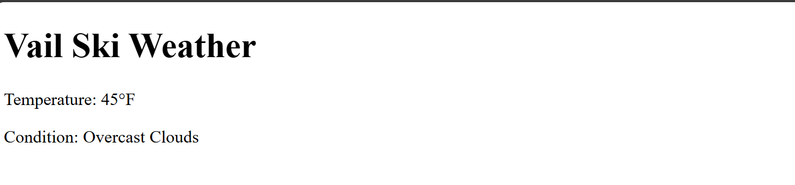

# Vail Ski Weather

This is a small project I built to check the ski weather in Vail, Colorado.

A lot of apps around the area are paid, so I wanted something free, simple, and quick that I (and others) could use.

## How to Run

1. Make sure you have Python 3 installed.

2. Open your terminal / command prompt and go into the project folder:

  cd vail-ski-weather

3. Install the required packages:

  pip install flask requests python-dotenv

4. Create a file called .env in the root folder and put your API key inside:

  OPENWEATHER_API_KEY=your_key_here

5. Start the app:

  python app.py

6. Open your browser and go to:

  http://127.0.0.1:5000

## Project Files

- **app.py** → main Flask app with one route

- **weather.py** → handles the OpenWeather API call and error handling

- **templates/index.html** → page layout

- **static/style.css** → a little styling

- **.gitignore** → keeps .env and extra files out of GitHub

## Screenshot

Here’s the app running locally:

## Notes

- The API key should never be uploaded (that’s why .env is ignored).

- It’s a simple project but solves a real problem — quick weather info for Vail.

- I kept it lightweight with Flask and plain HTML/CSS so it’s easy to understand.